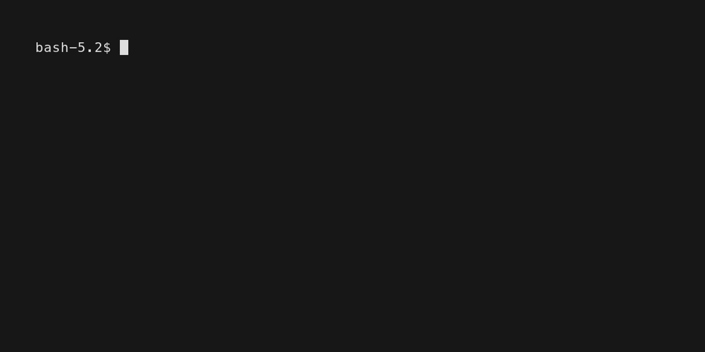

# Typing TUI

For my first Go project, I tried to port [Monkeytype] (a minimal version,
anyway) to the terminal.



## Getting started

**Requires Go 1.25.2+**

To start the application, from the project root, run:

```bash
go run .
```

[monkeytype]: https://monkeytype.com/
